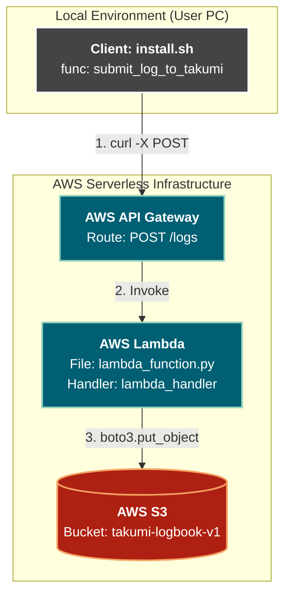
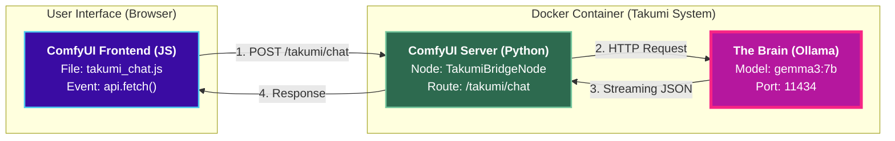

# The Takumi's Logbook (AWS Architecture)

```mermaid
graph TD
    %% 定義: クラスによるスタイリング（視認性向上）
    classDef local fill:#444444,stroke:#ffffff,stroke-width:2px,color:#ffffff;
    classDef cloud fill:#005f73,stroke:#94d2bd,stroke-width:2px,color:#ffffff;
    classDef storage fill:#ae2012,stroke:#f4a261,stroke-width:2px,color:#ffffff;

    subgraph Local["Local Environment (User PC)"]
        A["<b>Client: install.sh</b><br/>func: submit_log_to_takumi"]:::local
    end

    subgraph Cloud["AWS Serverless Infrastructure"]
        B["<b>AWS API Gateway</b><br/>Route: POST /logs"]:::cloud
        C["<b>AWS Lambda</b><br/>File: lambda_function.py<br/>Handler: lambda_handler"]:::cloud
        D[("<b>AWS S3</b><br/>Bucket: takumi-logbook-v1")]:::storage
    end

    A -->|1. curl -X POST| B
    B -->|2. Invoke| C
    C -->|3. boto3.put_object| D
```

# The Takumi Copilot (Interaction Flow)

```mermaid
graph LR
    %% 定義: クラスによるスタイリング
    classDef ui fill:#3a0ca3,stroke:#4cc9f0,stroke-width:2px,color:#ffffff;
    classDef server fill:#2d6a4f,stroke:#74c69d,stroke-width:2px,color:#ffffff;
    classDef brain fill:#b5179e,stroke:#f72585,stroke-width:4px,color:#ffffff;

    subgraph Browser["User Interface (Browser)"]
        A["<b>ComfyUI Frontend (JS)</b><br/>File: takumi_chat.js<br/>Event: api.fetch()"]:::ui
    end

    subgraph Container["Docker Container (Takumi System)"]
        B["<b>ComfyUI Server (Python)</b><br/>Node: TakumiBridgeNode<br/>Route: /takumi/chat"]:::server
        C["<b>The Brain (Ollama)</b><br/>Model: gemma3:7b<br/>Port: 11434"]:::brain
    end

    A -- "1. POST /takumi/chat" --> B
    B -- "2. HTTP Request" --> C
    C -- "3. Streaming JSON" --> B
    B -- "4. Response" --> A
```
