# System Architecture & Design Principles

> **[Why]** To visualize the structural integrity and data flow of the Takumi system.
> **[What]** Documentation of the containerization strategy, installer logic, AI interaction, and telemetry pipelines.

---

## 1. High-Level Concept: "The Factory"

The system operates on a **"Container-First"** philosophy. The Host OS serves only as a launcher, while all logic, dependencies, and AI models reside inside a reproducible Docker container.

---

## 2. Installer Architecture: "The Modular Core"

The installation logic has been refactored from a monolithic script into a **Modular Architecture**.
The entry point (`install.sh`) acts as an orchestrator, loading specialized libraries to handle specific tasks.

```mermaid
graph LR
    %% --- Node Styles ---
    classDef entry fill:#4cc9f0,stroke:#ffffff,stroke-width:2px,color:#0d1b2a;
    classDef lib fill:#1a365d,stroke:#4cc9f0,stroke-width:1px,color:#ffffff;
    classDef data fill:#ffffff,stroke:#0d1b2a,stroke-width:2px,color:#0d1b2a;
    
    %% --- Subgraph Styles (Fix for Yellow Background) ---
    %% Fill: Very Light Blue-Gray (#f1f5f9) instead of Yellow
    classDef groupStyle fill:#f1f5f9,stroke:#475569,stroke-width:2px,color:#0d1b2a;

    Entry("app/install.sh"):::entry

    subgraph Libraries ["📚 app/lib/"]
        Utils(utils.sh):::lib
        Logger(logger.sh):::lib
        BrainInterface(brain.sh):::lib
        Diagnostics(diagnostics.sh):::lib
        Concierge(concierge.sh):::lib
        Core(installer.sh):::lib
    end

    subgraph Data ["💾 app/config/"]
        Recipes[("JSON Recipes")]:::data
        Catalog[("Node Catalog")]:::data
    end

    Entry -->|Source| Libraries
    Core -->|Read| Recipes
    Core -->|Merge| Catalog
    Concierge -->|Select| Recipes
    BrainInterface -->|Consult| Brain["scripts/brain.py"]
    
    %% Apply Subgraph Styles explicitly
    class Libraries,Data groupStyle;
```

### **Module Responsibilities**

| Module | Responsibility (What) |
| :--- | :--- |
| **`utils.sh`** | Global constants, paths, and state variables. |
| **`logger.sh`** | Standardized logging outputs and error traps. |
| **`diagnostics.sh`** | Hardware inspection (NVIDIA GPU/CUDA version). |
| **`concierge.sh`** | Interactive menu for Use-Case selection. |
| **`brain.sh`** | Interface to Python AI script for error analysis. |
| **`installer.sh`** | Core logic for Conda/Pip/Custom Nodes installation. |

---

## 3. The Brain & Bridge: "Natural Language Interface"

How the User talks to the System. The `Takumi Bridge` acts as a translator between the User's intent (Natural Language) and ComfyUI's internal logic (JSON Graphs).

---

## 4. Telemetry Pipeline: "Dependency Resolver"

We collect data **only when things go wrong**.

---

## 5. Design Philosophy

### **Abstraction & Encapsulation**
We hide complexity. The user runs `make install`, and the system handles the chaos of Python versions, CUDA drivers, and compilation tools behind the scenes.

### **Idempotency**
You can run `make install` as many times as you want. The scripts check existing states and only apply necessary changes (Self-Healing).

### **Single Source of Truth**
*   **Version Control:** Git is the master.
*   **Environment:** Dockerfile is the definition.
*   **Recipes:** JSON files define the "correct" combination of libraries.
